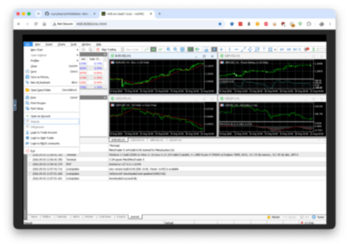

# mt5debian.sh

[](https://www.gnu.org/software/bash/)
[](https://www.debian.org/)
[](https://www.winehq.org/)
[](https://www.metatrader5.com/)
[](https://pypi.org/project/pymt5linux/)
[](LICENSE)

> Headless MetaTrader 5 on Debian via Wine, reachable over noVNC, with a Python bridge to drive it.

`mt5debian.sh` sets up MetaTrader 5 on a headless Debian VM via Wine, with
VNC/noVNC access and an optional RPyC bridge (via `pymt5linux`) so
external Python code can drive the running terminal.

Key features:

- One script: installs Wine, VNC/noVNC, WebView2, and MT5 itself
- Browser-based desktop access over noVNC — no local VNC client needed
- Optional `pymt5linux` bridge so Linux-side Python can drive the running
  terminal over RPyC
- Idempotent — safe to re-run; already-installed components and
  downloaded files are skipped, not redone
- Configurable noVNC, VNC, and bridge ports for running multiple copies
  on one host



## What it does

- Installs Wine (staging) from WineHQ's official repo, plus the X11/VNC
  stack (`tigervnc-standalone-server`, `novnc`, `websockify`) and the Mesa
  software-rendering libraries MT5's charts need.
- Starts Xvnc (display `:1` / port 5901 by default) with no window
  manager, and noVNC on top of it so you can reach the desktop from a
  browser.
- Downloads and installs the WebView2 Runtime (MT5's Market/news/signals
  panels are a WebView2 view) and MetaTrader 5 itself, inside a dedicated
  Wine prefix (`$HOME/.mt5`).
- Launches MT5 and waits for it to actually start.
- Installs a Windows-side Python (inside Wine) plus the `MetaTrader5` and
  `pymt5linux` packages, and starts the `pymt5linux` bridge server so
  Linux-side Python can call into the running terminal over RPyC.

## Why a Python bridge running inside Wine?

MT5's official `MetaTrader5` Python package talks to the terminal through
Windows-only IPC. It only works from inside the same Windows process space
MT5 runs in — it cannot be installed or called directly from Linux-side
Python. So a Python interpreter has to run inside Wine alongside MT5, and
`pymt5linux` bridges calls from Linux-side Python to it over RPyC.

`pymt5linux` (not the current `mt5linux` package) is used deliberately: it
keeps the original architecture where the bridge server runs inside Wine
using Windows Python. The current `mt5linux` package uses a different
`mt5server.exe`-based architecture — the two are not interchangeable.

## Requirements

- Debian 12 (bookworm) or 13 (trixie) — 13 tested. Other Debian releases
  are attempted
  with a warning rather than refused outright, but are untested; any
  distro other than Debian is refused outright.
- `sudo` access (apt, dpkg, and architecture changes require it).
- Outbound internet access to `dl.winehq.org`, `download.mql5.com`,
  `go.microsoft.com`, and `python.org`.

## User & permissions

Run this as a normal, non-root user — not as `root`, and not via `sudo
./mt5debian.sh`. Wine explicitly doesn't want to be run as root, and the
script's paths (`$HOME/.mt5`, `$HOME/.config/tigervnc`, the downloaded
installers) all assume a real user's home directory. `sudo` is invoked
internally only for the specific apt/dpkg/keyring steps that need it.

That user needs sudo privileges for those steps (apt, `dpkg
--add-architecture`, writing to `/etc/apt`). If you're running this
unattended (cron, a systemd unit, a non-interactive SSH command) rather
than from an already-open interactive shell, plain `sudo` will hang
waiting for a password prompt nothing can answer. Either:

- run it interactively once first so `sudo` caches your credentials for
  the session, or
- grant this user `NOPASSWD` sudo for the relevant commands in
  `/etc/sudoers.d/`.

## Usage

```bash
./mt5debian.sh
```

Re-run any time — it picks up from wherever it left off.

First run takes a while — the WebView2 and MetaTrader 5 installers
running under Wine are the slow part, not the downloads themselves.
Wine's own first-time bootstrap (installing Mono into the new prefix)
also adds to this on the very first `wine` invocation. Subsequent runs
are fast, since already-installed components are skipped.

If setting this up for multiple users on the same box, it can be worth
copying an already-bootstrapped `~/.mt5` prefix to the other users
rather than repeating the slow bootstrap for each one:

```bash
sudo cp -a ~/.mt5 /home/otheruser/.mt5
sudo chown -R otheruser:otheruser /home/otheruser/.mt5
```

Note that Wine bakes some absolute paths into the prefix's registry, so
this isn't guaranteed fully clean — if something misbehaves for the
copied-to user, falling back to a normal bootstrap for them is the safe
option.

Options:

```
-p, --password password             VNC password. Sets it non-interactively,
                                     overwriting any existing one. If
                                     omitted, an existing password is left
                                     alone; if none exists yet, vncserver
                                     prompts interactively as usual (and
                                     asks whether to also set a view-only
                                     password).
-P, --viewonly-password password    VNC view-only password. Only used
                                     together with -p/--password.
-w, --wine-version stable|staging|devel
                                     Force the Wine channel, overriding the
                                     default (staging — see Configuration
                                     below).
-n, --novnc-port port               noVNC web port, overriding the default
                                     (6080 — see Configuration below).
-b, --bridge-port port              pymt5linux bridge port, overriding the
                                     default (8001 — see Configuration
                                     below).
-v, --vnc-port port                 Raw VNC (RFB) port, overriding the
                                     default (5901 — see Configuration
                                     below).
--purge                             Kill any running Wine process for this
                                     prefix and delete it ($HOME/.mt5), then
                                     continue as a clean reinstall. Does not
                                     touch the VNC password or apt/Wine
                                     package installation.
-h, --help                          Show help and exit.
```

## Configuration

`WINE_VERSION`, `NOVNC_PORT`, `MT5SERVER_PORT`, and `VNC_PORT` can be
overridden via command-line flags (see Usage above); everything else is a
variable at the top of the script.

| Variable | Default | Purpose |
|---|---|---|
| `WINE_VERSION` | `staging` | Wine channel to install (`stable`, `staging`, or `devel`) — see below |
| `NOVNC_PORT` | `6080` | noVNC web port |
| `VNC_PORT` | `5901` | Raw VNC (RFB) port — see below |
| `MT5SERVER_PORT` | `8001` | `pymt5linux` bridge port |
| `MT5SERVER_HOST` | `127.0.0.1` | `pymt5linux` bridge bind address — see below |

### `WINE_VERSION`

`staging` is confirmed working on Debian. Force a different channel with
`-w`/`--wine-version` if you need to:

```bash
./mt5debian.sh --purge -w stable
```

### `NOVNC_PORT`, `VNC_PORT`, and `MT5SERVER_PORT`

Override with `-n`/`--novnc-port`, `-v`/`--vnc-port`, and
`-b`/`--bridge-port`. `VNC_PORT` must be > 5900 — TigerVNC addresses
displays rather than ports directly (port 5900+N is display `:N`), so the
display number used throughout is derived from this port.

The main reason to change any of these: running a second, independent copy
of this script as a different OS user on the same box (see
[Running multiple copies](#running-multiple-copies) below) — each copy
needs its own set of ports.

```bash
./mt5debian.sh -n 6081 -v 5902 -b 8002
```

### `MT5SERVER_HOST`

RPyC has no built-in authentication. The bridge defaults to loopback only.
If another host on your network needs to reach it, set this to this VM's
specific address (not `0.0.0.0`) and firewall the port to the intended
source.

## Running multiple copies

Each copy needs its own OS user (own `$HOME`, own Wine prefix) and its own
`-n`/`-v`/`-b` ports — pick a distinct set of three per user, e.g. user A
gets the defaults (6080/5901/8001) and user B gets `-n 6081 -v 5902 -b
8002`. The script's own log/PID files under `/tmp` are already namespaced
by port, so they won't collide between copies even though `/tmp` itself is
shared machine-wide.

That's process/filesystem separation by convention (distinct OS users),
not a hard security boundary — `/proc` is visible across users on a
default Debian install (`hidepid=0`), so e.g. `pgrep`-based "is MT5
already running" checks can in principle see another user's process, not
just your own. Fine for cooperating/trusted users on the same box. If you
ever need to run this for **mutually untrusted** users, revisit that:
either mount `/proc` with `hidepid=2`, or move to real isolation
(a Linux namespace/container per user, or `systemd-nspawn`) rather than
relying on OS-user separation alone. Not implemented here yet.

## Accessing MT5

## Accessing MT5

After a successful run, the script prints the noVNC URL(s) it's reachable
at, e.g. `http://<host>:6080/vnc.html` — one for the machine's hostname,
plus one for every non-loopback IPv4 and IPv6 address it has (link-local
`fe80::` addresses are skipped, since they need a zone id that a plain URL
can't express). Copy one of those printed URLs into a browser on your
workstation (not on the VM itself) to reach the MT5 desktop over noVNC;
the VNC password is set on first connection.

## Logs

Filenames are suffixed by `VNC_PORT`, so each copy of the script (see
[Running multiple copies](#running-multiple-copies)) gets its own:

- `/tmp/novnc-<VNC_PORT>.log` — noVNC/websockify
- `/tmp/mt5-terminal-<VNC_PORT>.log` — MT5 terminal stdout/stderr (deleted
  once MT5 is confirmed running; kept if startup fails)
- `/tmp/pymt5linux-server-<VNC_PORT>.log` — the bridge server (deleted
  once the bridge port is confirmed open; kept if it fails to come up)

## Troubleshooting

For a clean reinstall of Wine/MT5/WebView2/Python-in-Wine:

```bash
./mt5debian.sh --purge
```

This kills any running Wine process for the prefix, deletes it
(`~/.mt5`), then continues into a normal run to rebuild it. Killing
`wineserver` first matters — a leftover Wine process from the prefix
you just deleted would otherwise try to flush its registry to a
directory that no longer exists on exit (`wineserver: could not save
registry branch ... No such file or directory`). Harmless, since it's
the old deleted prefix, but worth avoiding.

This does not touch the VNC password (`~/.config/tigervnc/passwd`) or the apt/Wine
package installation — only what lives inside the Wine prefix.

## Limitations

- MT5 only. `pymt5linux` depends on MetaTrader's own `MetaTrader5` Python
  package, which doesn't exist for MT4 — there's no equivalent built-in
  Python bridge for MT4. Driving MT4 from Python needs a different
  approach entirely (an EA-based bridge over ZeroMQ/WebSocket, DDE, or a
  third-party API).
